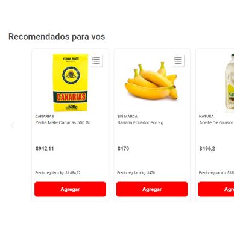

# 👋 Esteban Monguí (Tebi)

|  |  |
|--|--|
| <figure style="height:100px; width:100px; background-color: white; border-radius:50%; overflow:hidden"></figure> | As a seasoned software engineer, I am driven by a passion for excellence in software design and development. My technical expertise spans across the entire software development lifecycle, with a focus on front-end development and technical leadership. 

My approach to development is grounded in clean coding techniques and meticulous tool implementation, ensuring that every project I work on meets the highest standards of quality and usability. With a strong background in e-commerce problem-solving, I have a keen understanding of the unique challenges of developing software that delivers results in a dynamic and fast-paced environment.

I am deeply committed to the principles of Test Driven Development (TDD) and believe that a well-designed software architecture and comprehensive documentation are critical to the success of any project. My skill set includes expertise in TypeScript, React, and NodeJs, making me a valuable asset to any team looking to build robust and scalable software solutions.

With a focus on efficiency, assertiveness, and continuous learning, I have a proven track record of delivering expert-level software solutions that drive business success.

<section style="padding: 25px 0px">

## 🚀 Skills

| Professional Skills  | Technical Skills                         | Transversal skills         |
|----------------------|------------------------------------------|----------------------------|
|Software design       | web development                          | Creative and logic thinking|
|Front end development | unit, integration and performance testing| Continuous learning        |
|Processes design      | Object Oriented Programming              | Leadership and initiative  |
</section>

<section style="padding: 25px 0px">

## 💻 Tech Stack

| Category | Technology |
|----------|------------|
| Frontend | JavaScript, TypeScript, React, HTML5, CSS3 |
| Backend | NodeJs, Express |
| Database | Mongo Db |
| Testing | Jest, react testing library, k6, xk6, lighthouse |
</section>

<section style="padding: 25px 0px">

## 🔨 Main Projects

  

    <a href="https://www.disco.com.ar/" style="display: flex; flex-direction:column; justify-content:space-between; height: 100%;" >
      

        <figure style="">
          
        </figure> 
        <b> Recommendations </b> 
        An AWS personalize integration into a vtex based e-commerce to show recommended products to users along the transaction flow.  
      

      <em>Tech lead | Software design</em>
    </a>
  

  

    <a href="https://github.com/EstebanMongui/identity-provider/tree/feat/sellers-register" style="display: flex; flex-direction:column; justify-content:space-between; height: 100%">
      

        <figure>
          
        </figure> 
        <b>Identity Provider</b> 
        It is a basic identity provider to enable an authentication and authorization method based on SAML(Security Assertion Markup Language).
      

      <em>back end development</em>
    </a>
  

  

    <a href="[Project Link]" style="display: flex; flex-direction:column; justify-content:space-between; height: 100%">
      

         
        <b></b> 
      

      <em></em>
    </a>
  

</section>

<section style="padding: 25px 0px">

## 👇 About me

🎾 Practicing tennis (I'm a beginner)  
🤑 Learning about investing and assets analysis (ETFs and FICs specifically)  
_🚶 Working on my personal and professional growth  

<strong>Recommended books</strong>  
- "7 habits of highly effective people" by Stephen Covey
- "The intelligent investor" by Benjamin Graham
- "Lean analytics" by Erick Ries

<strong>Recommended podcasts</strong>

- "On porpose" by Jay Shetty
- "Mis propias finanzas" by Juan Pablo Zuluaga

</section>

<footer style="margin-top: 30px">

---
  
  <article align="center" style="display: flex; justify-content: space-around">
    <a href="https://www.linkedin.com/in/esteban-mongu%C3%AD/" style="display: flex; align-items: center">
       Esteban Monguí 
    </a>
    <a href="mailto:esteband.itorres@gmail.com" style="display: flex; align-items: center"> 
       esteband.itorres@gmail.com 
    </a>
    <a href="tel:+573223377495" style="display: flex; align-items: center"> 
       +57 322 337 7495
    </a>
  </article>
  <article align=center style="margin:20px 0px">
    Feel free to contact me! 🙋‍♂️
  </article>
</footer>
